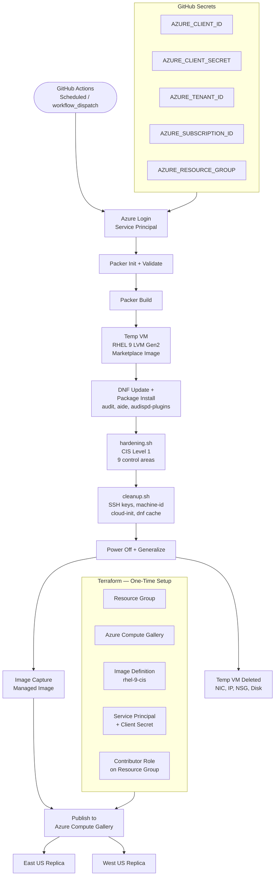

# Golden VM Image Pipeline
### Packer + GitHub Actions + Azure Compute Gallery | CIS-Hardened RHEL 9


**[▶ Watch me build this on Loom](Video coming soon)**


**Author:** Dane Willms [LinkedIn](https://www.linkedin.com/in/dane-willms-3612a9281/)


---

## The Problem This Solves

When engineers deploy VMs by picking whatever image is available (the latest marketplace image, a custom build someone made six months ago, an image with unknown packages), you get drift. Machines look different, have different security postures, and fail compliance scans in unpredictable ways.

This pipeline fixes that. It produces a single, known-good, CIS-hardened RHEL 9 base image on a weekly automated schedule. Every VM in the environment starts from this image, giving you consistent security posture across the fleet with no configuration drift at the OS level.

---

## Architecture



---

## What Gets Built

```
Golden-VM-Image-Pipeline/
├── .github/
│   └── workflows/
│       └── build-golden-image.yml     # Scheduled CI/CD pipeline
├── infra/
│   ├── main.tf                        # Gallery, SP, role assignment
│   ├── variables.tf
│   ├── outputs.tf                     # Outputs used as GitHub secrets
│   └── terraform.tfvars               # Your name + region (gitignored)
├── packer/
│   ├── rhel9.pkr.hcl                  # Packer build template
│   ├── variables.pkrvars.hcl          # Local testing only (gitignored)
│   └── scripts/
│       ├── hardening.sh               # CIS Level 1 hardening
│       └── cleanup.sh                 # Pre-capture image prep
└── .gitignore
```

**Azure resources (Terraform-managed):**
```
rg-golden-images-[yourname]
├── Azure Compute Gallery: gal_golden_images_[yourname]
│   └── Image Definition: rhel-9-cis
│       └── Image Versions (timestamped, replicated East US + West US)
└── Service Principal: sp-packer-golden-images-[yourname]
```

---

## CIS Hardening Coverage

The `hardening.sh` script implements a subset of the CIS RHEL 9 Level 1 benchmark across 9 control areas:

| # | Control Area | What Gets Applied |
|---|---|---|
| 1 | Filesystem | Unnecessary filesystem modules disabled via modprobe |
| 2 | SELinux | Enforcing mode, targeted policy |
| 3 | SSH | Root login disabled, password auth off, idle timeout, banner |
| 4 | Password Policy | 14-char minimum, complexity requirements via pwquality |
| 5 | Audit Logging | auditd rules for identity files, sudoers, SSH config, setuid |
| 6 | Firewall | firewalld in drop zone, SSH-only inbound |
| 7 | Network | IP forwarding off, SYN cookies, redirect rejection, martian logging |
| 8 | Services | Unnecessary services disabled (cups, nfs, httpd, snmpd, etc.) |
| 9 | Login Banner | Authorized use only banner on `/etc/issue` and `/etc/issue.net` |

---

## Prerequisites

- Active Azure subscription
- GitHub account with a repository created for this project
- [Terraform](https://developer.hashicorp.com/terraform/install) installed
- [Azure CLI](https://learn.microsoft.com/en-us/cli/azure/install-azure-cli) installed
- [Packer](https://developer.hashicorp.com/packer/install) installed (for local testing)

**Install Packer — Mac:**
```bash
brew tap hashicorp/tap
brew install hashicorp/tap/packer
packer --version
```

**Install Packer — Windows (PowerShell):**
```powershell
choco install packer
packer --version
```

---

## Part 1 — Azure Infrastructure (Terraform)

All Azure resources are provisioned with Terraform. Nothing is created manually.

### Create the infra/ directory

**Mac:**
```bash
mkdir -p infra
touch infra/main.tf infra/variables.tf infra/outputs.tf infra/terraform.tfvars
```

**Windows (PowerShell):**
```powershell
New-Item -ItemType Directory -Force -Path infra | Out-Null
New-Item -ItemType File -Force -Path infra\main.tf, infra\variables.tf, infra\outputs.tf, infra\terraform.tfvars | Out-Null
```

### Step 1 — `infra/variables.tf`

```hcl
variable "yourname" {
  description = "Your name, lowercase, no spaces. Used in all resource names."
  type        = string
}

variable "location" {
  type    = string
  default = "eastus"
}

variable "tags" {
  type = map(string)
  default = {
    project    = "golden-images"
    managed_by = "terraform"
  }
}
```

### Step 2 — `infra/terraform.tfvars`

```hcl
yourname = "yourname"
location = "eastus"
```

> **Important:** Add `*.tfvars` to your `.gitignore` before committing.

### Step 3 — `infra/main.tf`

```hcl
terraform {
  required_providers {
    azurerm = {
      source  = "hashicorp/azurerm"
      version = "~> 3.0"
    }
    azuread = {
      source  = "hashicorp/azuread"
      version = "~> 2.0"
    }
  }
}

provider "azurerm" {
  features {}
}

provider "azuread" {}

data "azurerm_client_config" "current" {}
data "azuread_client_config" "current" {}

resource "azurerm_resource_group" "main" {
  name     = "rg-golden-images-${var.yourname}"
  location = var.location
  tags     = var.tags
}

resource "azurerm_shared_image_gallery" "main" {
  name                = "gal_golden_images_${var.yourname}"
  resource_group_name = azurerm_resource_group.main.name
  location            = azurerm_resource_group.main.location
  description         = "Golden VM images — CIS hardened, built by Packer"
  tags                = var.tags
}

resource "azurerm_shared_image" "rhel9_cis" {
  name                = "rhel-9-cis"
  gallery_name        = azurerm_shared_image_gallery.main.name
  resource_group_name = azurerm_resource_group.main.name
  location            = azurerm_resource_group.main.location
  os_type             = "Linux"
  hyper_v_generation  = "V2"

  identifier {
    publisher = "YourPublisherName"
    offer     = "RHEL"
    sku       = "9-CIS-Hardened"
  }

  tags = var.tags
}

resource "azuread_application" "packer" {
  display_name = "sp-packer-golden-images-${var.yourname}"
  owners       = [data.azuread_client_config.current.object_id]
}

resource "azuread_service_principal" "packer" {
  client_id                    = azuread_application.packer.client_id
  app_role_assignment_required = false
  owners                       = [data.azuread_client_config.current.object_id]
}

resource "azuread_service_principal_password" "packer" {
  service_principal_id = azuread_service_principal.packer.object_id

  rotate_when_changed = {
    rotation_id = "v1"
  }
}

resource "azurerm_role_assignment" "packer_contributor" {
  scope                = azurerm_resource_group.main.id
  role_definition_name = "Contributor"
  principal_id         = azuread_service_principal.packer.object_id
}
```

### Step 4 — `infra/outputs.tf`

```hcl
output "resource_group_name" {
  value = azurerm_resource_group.main.name
}

output "gallery_name" {
  value = azurerm_shared_image_gallery.main.name
}

output "image_definition_name" {
  value = azurerm_shared_image.rhel9_cis.name
}

output "packer_client_id" {
  value     = azuread_application.packer.client_id
  sensitive = true
}

output "packer_client_secret" {
  value     = azuread_service_principal_password.packer.value
  sensitive = true
}

output "tenant_id" {
  value = data.azurerm_client_config.current.tenant_id
}

output "subscription_id" {
  value = data.azurerm_client_config.current.subscription_id
}
```

### Step 5 — Deploy

```bash
az login
az account set --subscription "Your Subscription Name"
cd infra
terraform init
terraform plan
terraform apply
```

Expect 7 resources: resource group, gallery, image definition, AAD application, service principal, service principal password, and role assignment.

---

## Part 2 — GitHub Repository Setup

### Step 6 — Add GitHub Secrets

Navigate to **Settings → Secrets and variables → Actions** in your GitHub repository and add the following secrets. All values come directly from `terraform output`.

| Secret Name | How to Get the Value |
|---|---|
| `AZURE_CLIENT_ID` | `terraform output -raw packer_client_id` |
| `AZURE_CLIENT_SECRET` | `terraform output -raw packer_client_secret` |
| `AZURE_TENANT_ID` | `terraform output -raw tenant_id` |
| `AZURE_SUBSCRIPTION_ID` | `terraform output -raw subscription_id` |
| `AZURE_RESOURCE_GROUP` | `terraform output -raw resource_group_name` |

> **Critical:** The `AZURE_RESOURCE_GROUP` value must include your name suffix (e.g., `rg-golden-images-yourname`). Using a partial name will cause Packer to fail with a 404 on the gallery lookup.

### Step 7 — Create the Repository Structure

**Mac:**
```bash
mkdir -p .github/workflows
mkdir -p packer/scripts

touch .github/workflows/build-golden-image.yml
touch packer/rhel9.pkr.hcl
touch packer/variables.pkrvars.hcl
touch packer/scripts/hardening.sh
touch packer/scripts/cleanup.sh

# Required — Packer cannot execute scripts without execute permission
chmod +x packer/scripts/hardening.sh
chmod +x packer/scripts/cleanup.sh
```

**Windows (PowerShell):**
```powershell
New-Item -ItemType Directory -Force -Path '.github\workflows' | Out-Null
New-Item -ItemType Directory -Force -Path 'packer\scripts' | Out-Null

New-Item -ItemType File -Force -Path '.github\workflows\build-golden-image.yml' | Out-Null
New-Item -ItemType File -Force -Path 'packer\rhel9.pkr.hcl' | Out-Null
New-Item -ItemType File -Force -Path 'packer\variables.pkrvars.hcl' | Out-Null
New-Item -ItemType File -Force -Path 'packer\scripts\hardening.sh' | Out-Null
New-Item -ItemType File -Force -Path 'packer\scripts\cleanup.sh' | Out-Null
```

### `.gitignore`

```gitignore
# Packer variable files (contain subscription ID)
*.pkrvars.hcl

# Terraform sensitive files
*.tfvars
*.tfstate
*.tfstate.backup
.terraform/
.terraform.lock.hcl

# Packer build artifacts
manifest.json
manifest.json.lock
packer_cache/

# OS noise
.DS_Store
Thumbs.db
```

---

## Part 3 — Packer Template

### Step 8 — `packer/rhel9.pkr.hcl`

```hcl
packer {
  required_plugins {
    azure = {
      source  = "github.com/hashicorp/azure"
      version = "~> 2.0"
    }
  }
}

variable "subscription_id" {
  type = string
}

variable "resource_group" {
  type = string
}

variable "gallery_name" {
  type    = string
  default = "gal_golden_images"
}

variable "image_definition" {
  type    = string
  default = "rhel-9-cis"
}

variable "location" {
  type    = string
  default = "East US"
}

variable "build_vm_size" {
  description = "Size of the temporary VM Packer uses during the build. Deleted after image capture."
  type        = string
  default     = "Standard_D2s_v3"
}

source "azure-arm" "rhel9_cis" {
  use_azure_cli_auth = true

  subscription_id           = var.subscription_id
  build_resource_group_name = var.resource_group
  vm_size                   = var.build_vm_size

  image_publisher = "RedHat"
  image_offer     = "RHEL"
  image_sku       = "9-lvm-gen2"
  image_version   = "latest"

  os_type = "Linux"

  managed_image_name                = "rhel-9-cis-${formatdate("YYYYMMDD-hhmm", timestamp())}"
  managed_image_resource_group_name = var.resource_group

  shared_image_gallery_destination {
    resource_group      = var.resource_group
    gallery_name        = var.gallery_name
    image_name          = var.image_definition
    image_version       = formatdate("0.YYYYMMDD.hhmm", timestamp())
    replication_regions = ["East US", "West US"]
  }

  azure_tags = {
    project    = "golden-images"
    hardening  = "cis-level1"
    managed_by = "packer"
  }
}

build {
  sources = ["source.azure-arm.rhel9_cis"]

  provisioner "shell" {
    inline = [
      "echo 'Updating package index...'",
      "sudo dnf update -y",
      "sudo dnf install -y audit audispd-plugins aide"
    ]
  }

  provisioner "shell" {
    scripts = [
      "${path.root}/scripts/hardening.sh",
      "${path.root}/scripts/cleanup.sh"
    ]
    execute_command = "sudo sh -c '{{ .Vars }} {{ .Path }}'"
  }

  post-processor "manifest" {
    output     = "manifest.json"
    strip_path = true
  }
}
```

> **Note:** `build_resource_group_name` tells Packer to build inside your existing resource group rather than creating a new temporary one. This is required when your service principal has Contributor scoped to the resource group rather than the subscription. You cannot combine this with a top-level `location` field. Packer infers the location from the resource group automatically.

### Step 9 — `packer/variables.pkrvars.hcl` (local testing only)

```hcl
subscription_id  = "your-subscription-id"
resource_group   = "rg-golden-images-yourname"
gallery_name     = "gal_golden_images_yourname"
image_definition = "rhel-9-cis"
location         = "East US"
build_vm_size    = "Standard_D2s_v3"
```

This file is gitignored and used only for local runs. GitHub Actions uses `PKR_VAR_` environment variables instead. Get the exact `gallery_name` value by running `terraform output -raw gallery_name` from the `infra/` directory.

### Step 10 — `packer/scripts/hardening.sh`

```bash
#!/bin/bash
set -euo pipefail

echo "=== CIS Level 1 Hardening — RHEL 9 ==="

# ── 1. Filesystem Configuration ──────────────────────────────
echo "[1] Configuring filesystem mount options..."

for fs in cramfs freevxfs jffs2 hfs hfsplus squashfs udf; do
  echo "install $fs /bin/true" >> /etc/modprobe.d/disabled-filesystems.conf
done

# ── 2. SELinux Enforcement ───────────────────────────────────
echo "[2] Configuring SELinux..."

sed -i 's/^SELINUX=.*/SELINUX=enforcing/' /etc/selinux/config
sed -i 's/^SELINUXTYPE=.*/SELINUXTYPE=targeted/' /etc/selinux/config
setenforce 1 2>/dev/null || true

# ── 3. SSH Hardening ─────────────────────────────────────────
echo "[3] Hardening SSH configuration..."

cat > /etc/ssh/sshd_config.d/cis-hardening.conf << 'SSHEOF'
Protocol 2
LogLevel VERBOSE
LoginGraceTime 60
PermitRootLogin no
MaxAuthTries 4
PubkeyAuthentication yes
PasswordAuthentication no
PermitEmptyPasswords no
AllowAgentForwarding no
AllowTcpForwarding no
X11Forwarding no
ClientAliveInterval 15
ClientAliveCountMax 3
Banner /etc/issue.net
SSHEOF

sshd -t

# ── 4. Password Policy ───────────────────────────────────────
echo "[4] Configuring password policy..."

sed -i 's/^PASS_MAX_DAYS.*/PASS_MAX_DAYS   365/' /etc/login.defs
sed -i 's/^PASS_MIN_DAYS.*/PASS_MIN_DAYS   1/'   /etc/login.defs
sed -i 's/^PASS_WARN_AGE.*/PASS_WARN_AGE   7/'   /etc/login.defs

dnf install -y libpwquality

cat > /etc/security/pwquality.conf << 'PWEOF'
minlen = 14
minclass = 4
dcredit = -1
ucredit = -1
ocredit = -1
lcredit = -1
PWEOF

# ── 5. Audit Logging ─────────────────────────────────────────
echo "[5] Configuring auditd..."

dnf install -y audit

cat > /etc/audit/rules.d/cis.rules << 'AUDITEOF'
-D
-b 8192
-w /etc/passwd  -p wa -k identity
-w /etc/shadow  -p wa -k identity
-w /etc/sudoers -p wa -k sudoers
-w /etc/ssh/sshd_config -p wa -k sshd
-w /etc/selinux/ -p wa -k selinux
-a always,exit -F arch=b64 -S execve -C uid!=euid -F euid=0 -k setuid
AUDITEOF

systemctl enable --now auditd

# ── 6. Firewalld ─────────────────────────────────────────────
echo "[6] Configuring firewalld..."

dnf install -y firewalld
systemctl enable --now firewalld
firewall-cmd --set-default-zone=drop
firewall-cmd --permanent --zone=drop --add-service=ssh
firewall-cmd --reload

# ── 7. Network Hardening ─────────────────────────────────────
echo "[7] Hardening network settings..."

cat > /etc/sysctl.d/99-cis-hardening.conf << 'SYSCTLEOF'
net.ipv4.ip_forward = 0
net.ipv4.tcp_syncookies = 1
net.ipv4.conf.all.accept_redirects = 0
net.ipv4.conf.all.log_martians = 1
net.ipv6.conf.all.disable_ipv6 = 1
SYSCTLEOF

sysctl -p /etc/sysctl.d/99-cis-hardening.conf

# ── 8. Disable Unnecessary Services ─────────────────────────
echo "[8] Disabling unnecessary services..."

for svc in avahi-daemon cups dhcpd slapd nfs-server rpcbind named vsftpd httpd dovecot smb squid snmpd; do
  systemctl disable "$svc" 2>/dev/null || true
  systemctl stop    "$svc" 2>/dev/null || true
done

# ── 9. Login Banner ──────────────────────────────────────────
echo "[9] Setting login banner..."

cat > /etc/issue.net << 'BANNEREOF'
AUTHORIZED USE ONLY. Unauthorized access is prohibited and will be prosecuted.
All activity is monitored and logged.
BANNEREOF

cp /etc/issue.net /etc/issue

echo "=== CIS hardening complete ==="
```

### Step 11 — `packer/scripts/cleanup.sh`

```bash
#!/bin/bash
set -euo pipefail

echo "=== Image cleanup for capture ==="

# Remove SSH host keys — regenerated on first boot of each deployed VM
rm -f /etc/ssh/ssh_host_*

# Clear cloud-init state so it runs fresh on first boot
cloud-init clean --logs

# Remove package manager cache
dnf clean all

# Remove shell history
history -c
cat /dev/null > ~/.bash_history

# Remove temporary files
rm -rf /tmp/* /var/tmp/*

# Remove machine ID — critical step
# Without this, all VMs deployed from this image share the same machine ID,
# which breaks systemd, DHCP client behavior, and other services.
truncate -s 0 /etc/machine-id
rm -f /var/lib/dbus/machine-id
mkdir -p /var/lib/dbus
ln -s /etc/machine-id /var/lib/dbus/machine-id

sync

echo "=== Cleanup complete. Ready for image capture. ==="
```

> **Note:** The `mkdir -p /var/lib/dbus` line is required. RHEL 9 PAYG marketplace images do not always pre-create this directory, and the symlink will fail without it.

---

## Part 4 — GitHub Actions Workflow

### Step 12 — `.github/workflows/build-golden-image.yml`

```yaml
name: Build Golden VM Image

on:
  schedule:
    - cron: '0 2 * * 0'
  workflow_dispatch:

env:
  IMAGE_DEFINITION: "rhel-9-cis"
  GALLERY_NAME: "gal_golden_images_yourname"

jobs:
  build:
    name: Build and Publish Golden Image
    runs-on: ubuntu-latest

    steps:
      - name: Checkout
        uses: actions/checkout@v4

      - name: Azure Login
        uses: azure/login@v1
        with:
          creds: '{"clientId":"${{ secrets.AZURE_CLIENT_ID }}","clientSecret":"${{ secrets.AZURE_CLIENT_SECRET }}","tenantId":"${{ secrets.AZURE_TENANT_ID }}","subscriptionId":"${{ secrets.AZURE_SUBSCRIPTION_ID }}"}'

      - name: Install Packer
        run: |
          wget -O- https://apt.releases.hashicorp.com/gpg | sudo gpg --dearmor -o /usr/share/keyrings/hashicorp-archive-keyring.gpg
          echo "deb [signed-by=/usr/share/keyrings/hashicorp-archive-keyring.gpg] https://apt.releases.hashicorp.com $(lsb_release -cs) main" | sudo tee /etc/apt/sources.list.d/hashicorp.list
          sudo apt-get update && sudo apt-get install -y packer
          packer --version

      - name: Packer Init
        working-directory: packer
        run: packer init rhel9.pkr.hcl

      - name: Packer Validate
        working-directory: packer
        env:
          PKR_VAR_subscription_id: ${{ secrets.AZURE_SUBSCRIPTION_ID }}
          PKR_VAR_resource_group: ${{ secrets.AZURE_RESOURCE_GROUP }}
        run: packer validate rhel9.pkr.hcl

      - name: Packer Build
        working-directory: packer
        env:
          PKR_VAR_subscription_id: ${{ secrets.AZURE_SUBSCRIPTION_ID }}
          PKR_VAR_resource_group: ${{ secrets.AZURE_RESOURCE_GROUP }}
          PKR_VAR_gallery_name: ${{ env.GALLERY_NAME }}
          PKR_VAR_image_definition: ${{ env.IMAGE_DEFINITION }}
        run: |
          packer build \
            -color=false \
            -timestamp-ui \
            rhel9.pkr.hcl

      - name: Upload Build Manifest
        uses: actions/upload-artifact@v4
        with:
          name: packer-manifest-${{ github.run_number }}
          path: packer/manifest.json
          retention-days: 90

      - name: Report Image Version
        run: |
          echo "Image published to: ${{ env.GALLERY_NAME }}"
          az sig image-version list \
            --resource-group ${{ secrets.AZURE_RESOURCE_GROUP }} \
            --gallery-name ${{ env.GALLERY_NAME }} \
            --gallery-image-definition ${{ env.IMAGE_DEFINITION }} \
            --query "[].{Version:name, State:provisioningState}" \
            --output table
```

> **Update `GALLERY_NAME`** in the `env` block to match your gallery name including your name suffix (e.g., `gal_golden_images_yourname`). The `*.pkrvars.hcl` file is gitignored and not available to the runner — GitHub Actions passes variables via `PKR_VAR_` environment variables instead.

---

## Part 5 — Local Testing

### Step 13 — Test locally before pushing

```bash
cd packer
packer init rhel9.pkr.hcl
packer validate -var-file variables.pkrvars.hcl rhel9.pkr.hcl
packer build -var-file variables.pkrvars.hcl rhel9.pkr.hcl
```

> **Windows note:** Use a space between `-var-file` and the filename, not `=`. The `=` syntax causes PowerShell to silently show usage output instead of running the command.

### Step 14 — Verify the published image

**Mac:**
```bash
az sig image-version list \
  --resource-group rg-golden-images-yourname \
  --gallery-name gal_golden_images_yourname \
  --gallery-image-definition rhel-9-cis \
  --output table
```

**Windows (PowerShell):**
```powershell
az sig image-version list `
  --resource-group rg-golden-images-yourname `
  --gallery-name gal_golden_images_yourname `
  --gallery-image-definition rhel-9-cis `
  --output table
```

You should see at least one version with `provisioningState: Succeeded`.

---

## Verification Checklist

| Check | What to Confirm |
|---|---|
| Gallery exists | `gal_golden_images_[yourname]` visible in Azure portal |
| Image definition exists | `rhel-9-cis` appears inside the gallery |
| GitHub Actions workflow runs | No errors on manual trigger via `workflow_dispatch` |
| Image version published | At least one version with state `Succeeded` |
| Replication complete | Version replicated to both East US and West US |
| Manifest artifact uploaded | `manifest.json` artifact downloadable from the Actions run |
| Local validate passes | `packer validate` returns `The configuration is valid.` |

---

## Troubleshooting

The following issues were encountered during this build and are documented here for reference.

---

### `Duplicate required_plugin."azure" block`

**Cause:** The `azure` plugin was declared twice in the `packer {}` block, typically from copying a template that already contained the block.

**Fix:** Remove the duplicate block so only one `azure` entry remains under `required_plugins`, then re-run `packer init`.

---

### `packer validate` shows usage output instead of running (Windows)

**Cause:** On Windows PowerShell, `-var-file=filename` with the `=` sign can cause argument parsing failures. Packer silently falls back to printing usage.

**Fix:** Use a space instead of `=`:
```powershell
packer validate -var-file variables.pkrvars.hcl rhel9.pkr.hcl
```

---

### `Unsupported attribute` errors for variables (location, build_vm_size, image_definition)

**Cause:** The variable declarations were missing from `rhel9.pkr.hcl`. The template referenced `var.location`, `var.build_vm_size`, and `var.image_definition` but they were never declared with `variable` blocks. Note that `packer validate -syntax-only` passes even without declarations. The error only surfaces when Packer tries to resolve variables.

**Fix:** Add the missing `variable` blocks between the `packer {}` block and the `source` block.

---

### `storage_account and resource_group_name must be specified together`

**Cause:** `resource_group_name` at the top of the `source` block is for unmanaged VHD images stored in a storage account. When using managed images with `managed_image_resource_group_name`, this field is not needed and conflicts.

**Fix:** Remove `resource_group_name = var.resource_group` from the source block. Keep `managed_image_resource_group_name`. That is the correct field for managed images.

---

### `Specify either a location or build_resource_group_name, but not both`

**Cause:** When using `build_resource_group_name` to build inside an existing resource group, Packer infers the location from that resource group. Providing `location` at the same time creates a conflict.

**Fix:** Remove `location = var.location` from the source block when `build_resource_group_name` is present.

---

### `AuthorizationFailed` — cannot create resource group (GitHub Actions only)

**Cause:** The service principal has Contributor scoped to the resource group, not the subscription. Packer's default behavior creates a new temporary resource group per build, which requires subscription-level permissions.

**Fix:** Use `build_resource_group_name = var.resource_group` in the source block to direct Packer to build inside the existing resource group instead of creating a new one.

---

### `Invalid action input 'client-secret'` on `azure/login@v1`

**Cause:** The `azure/login@v1` action updated its authentication interface. The individual `client-id`, `client-secret`, `tenant-id`, `subscription-id` inputs are no longer valid.

**Fix:** Use the `creds` input with a JSON credential object:
```yaml
- name: Azure Login
  uses: azure/login@v1
  with:
    creds: '{"clientId":"${{ secrets.AZURE_CLIENT_ID }}","clientSecret":"${{ secrets.AZURE_CLIENT_SECRET }}","tenantId":"${{ secrets.AZURE_TENANT_ID }}","subscriptionId":"${{ secrets.AZURE_SUBSCRIPTION_ID }}"}'
```

---

### Gallery or image definition not found (404) in GitHub Actions

**Cause:** The `GALLERY_NAME` env var in the workflow or the `AZURE_RESOURCE_GROUP` secret was missing the name suffix (e.g., `gal_golden_images` instead of `gal_golden_images_yourname`).

**Fix:** Verify both values include your full suffix:
- `GALLERY_NAME` in the workflow `env` block
- `AZURE_RESOURCE_GROUP` secret in GitHub Settings

Run `terraform output -raw gallery_name` and `terraform output -raw resource_group_name` from `infra/` to get exact values.

---

### `ln: failed to create symbolic link '/var/lib/dbus/machine-id': No such file or directory`

**Cause:** RHEL 9 PAYG marketplace images do not always pre-create `/var/lib/dbus/`. The cleanup script fails when trying to create the `machine-id` symlink because `set -euo pipefail` causes any non-zero exit to terminate the script immediately.

**Fix:** Add `mkdir -p /var/lib/dbus` before the `ln` command in `cleanup.sh`:
```bash
truncate -s 0 /etc/machine-id
rm -f /var/lib/dbus/machine-id
mkdir -p /var/lib/dbus
ln -s /etc/machine-id /var/lib/dbus/machine-id
```

---

## Teardown

All infrastructure was provisioned with Terraform and is destroyed the same way. This removes the resource group, gallery, all image versions, the image definition, the service principal, and the role assignment.

```bash
cd infra
terraform destroy
```

---

## Cost

| Item | Estimated Cost |
|---|---|
| Temporary build VM (`Standard_D2s_v3`) | ~$0.10–$0.20 per build run |
| Managed image storage | ~$0.10–$0.20 per image |
| Gallery replication (East US + West US) | Additional per GB replicated |
| Total per weekly build | ~$0.50–$2.00 |